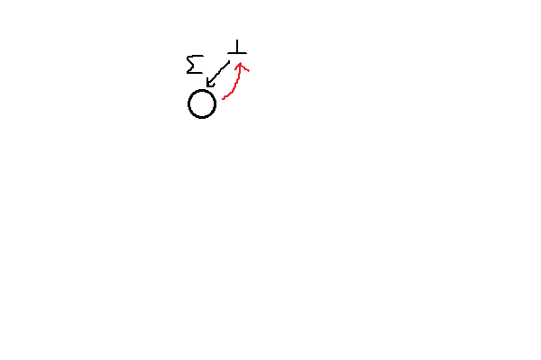

这篇文章基本是我对[^1]的一些翻译。

## Ukkonen 算法

Ukkonen 的后缀树构造算法是线性且在线的算法。

在这之前的有 Weiner 提出的从右往左扫描文本串并按照后缀长度递增的顺序加入树中来构造的算法。

而 McCreight 的算法是按照后缀长度递减的顺序加入树中来构造。这两种都不是在线算法。

Ukkonen 算法是最容易理解且基于后缀 Trie 的，尽管后缀 Trie 是平方级别的时间，但是一个显而易见的改造就可以使得其变成线性。

## 构造后缀 Trie

令 $T=t_1t_2\dots t_n$ 为一个字符集为 $\Sigma$ 的字符串（下简称串）。每个串 $x$ 形如 $T=uxv$ 其中 $u$ 和 $v$ （可能为空串）是 $T$ 的子串，并且每个 $T_i=t_i\dots t_n$ 其中 $1\leq i\leq n+1$ 为 $T$ 的后缀；特别的， $T_{n+1}=\epsilon$ 为空后缀。所有 $T$ 的后缀的集合记作 $\sigma(T)$ 。

更正规的，我们记 $T$ 的后缀 Trie 为 $STrie(T)=(Q\cup \{\bot\},root,F,g,f)$ 为一个扩展的确定性有穷状态自动机--具有树的形状的状态转移的图来表示 $\sigma(T)$ 的 Trie 而扩展指的是有一些所谓的后缀函数 $f$ 和一个辅助的状态 $\bot$ 。状态的集合 $Q$ 可以和 $T$ 的子串一一对应。我们记 $\overline x$ 为 子串 $x$ 对应的状态。

初始状态 $root$ 对应一个空串 $\epsilon$ 且终态的集合 $F$ 对应 $\sigma(T)$ 。转移函数 $g$ 定义为 $g(\overline x,a)=\overline y$ 对于所有 $\overline x$ 和 $\overline y$ 满足 $y=xa$ 其中 $a\in\Sigma$ 。

后缀函数 $f$ 定义为对于下列每个状态 $\overline x\in Q$ 有

- $x\neq root$ 时，那么对于某个 $a\in\Sigma$ 有 $x=ay$ ，我们令 $f(\overline x)=\overline y$ ；
- $f(root)=\bot$ 。

!!! note "通俗的说法"

    相较于论文上非常正式的定义，一个更通俗的解释是我们将这个状态转移的图（不考虑后缀链接）看成一棵树（事实上也是树形结构的），其中 $Q$ 为所有状态的集合， $F$ 为终态的集合（如果所有后缀都不是某个后缀的前缀，那么就是 Trie 中的叶子，否则可能包含内部节点）， $g$ 为树边，而 $f$ 则为后缀链接（在加入了后缀链接后，这个图也就不是树形的了）， $root$ 为起始状态（树根）。

???+ note "后缀树"
    
    字符串 $\texttt{banana#}$ 的后缀树。

    ```mermaid
    stateDiagram-v2
        [*] --> 1 : banana#
        [*] --> 2 : a
        2 --> 3 : na
        3 --> 4 : na#
        3 --> 5 : #
        2 --> 6 : #
        [*] --> 7 : na
        7 --> 8 : na#
        7 --> 9 : #
        [*] --> 10 : #
    ```

其中辅助状态 $\bot$ 让我们显式的避免了空后缀和非空后缀（或者说 $root$ 和其他状态）的区别。 $\bot$ 状态可以由任何 $a\in\Sigma$ 由 $g(\bot ,a)=root$ 连接到 Trie 。我们让 $f(\bot)$ 为未定义。（注意从 $\bot$ 到 $root$ 的转移始终与其他转移一起定义： $\bot$ 状态为任何 $a\in\Sigma$ 的逆也就是 $a^{-1}$ 。因为 $a^{-1}a=\epsilon$ ，我们有 $g(\bot, a)=root$ 因为 $root$ 相当于空串。）

我们称 $f(r)$ 为一个 $r$ 状态的后缀链接。后缀链接将在构造后缀树时被使用到；也有许多其他的用途。

注意到自动机 $STrie(T)$ 与 Aho-Corasick 的多串匹配自动机是一样的，而这些串的集合为 $\{T_i\mid 1\leq i\leq n+1\}$ （后缀链接在其中被称为失配转移）。

!!! note "图 1"

    构造 $STrie(\texttt{cacao})$ ：状态转移使用黑色箭头，而失配转移使用红色箭头。

    

我们在线从左往右扫描文本串 $T$ 来构造 $STrie(T)$ 是简单的，过程如下。令 $T^i$ 表示 $T$ 的前缀 $t_1\dots t_i$ 其中 $0\leq i\leq n$ 。根据一般的结果构造过程对于 $i=0,1,\dots, n$ 依次给出了 $STrie(T^i)$ 。在 图 1 中展示了构造 $STrie(\texttt{cacao})$ 的不同阶段。

如何从 $STrie(T^{i-1})$ 得到 $STrie(T^i)$ 的关键在于观察到 $T^i$ 的后缀可以由每个 $T^{i-1}$ 的后缀后面拼接一个 $t_i$ 和增加一个空后缀得到。即

$$\sigma(T^i)=\sigma(T^{i-1})t_i\cup \{\epsilon\}$$

通过定义， $STrie(T^{i-1})$ 接收所有 $\sigma(T^{i-1})$ 。为了使其接收 $\sigma(T^i)$ 我们必须检查 $STrie(T^{i-1})$ 的终态集合 $F_{i-1}$ 。如果 $r\in F_{i-1}$ 不是一个 $t_i$-转移，那么加入从 $r$ 到一个新状态（成为 Trie 的新叶子）的转移。

一些老的或新的从 $F_{i-1}$ 出发的 $t_i$-转移和 $root$ 组合在一起为 $STrie(T^i)$ 的终态 $F_i$ 。

得到新的转移的状态 $r\in F_{i-1}$ 可以通过后缀链接来找到。后缀函数的定义导出了 $r\in F_{i-1} \iff r=f^{j}(\overline{t_1\dots t_{i-1}})$ 对于 $0\leq j\leq i-1$ 成立。因此 $STrie(T^{i-1})$ 的 $F_{i-1}$ 中的所有状态都在最深的状态 $\overline{t_1\dots t_{i-1}}$ 的后缀链接形成的路径上，这条路径终于 $\bot$ 。我们称这条重要的路径为 $STrie(T^{i-1})$ 的边界路径。

如果一个在边界路径上的状态 $\overline{z}$ 没有一个在 $t_i$ 的转移，那么加入一个新的状态 $\overline{zt_i}$ 和一个新的转移 $g(\overline{z},t_i)=\overline{zt_i}$ 。这更新了 $g$ 。为了更新 $f$ ，新的状态 $\overline{zt_i}$ 与一个新的后缀链接连在一起，形成了一个从 $\overline{t_1\dots t_i}$ 的路径。显然，这是 $STrie(T^i)$ 的边界路径。

在边界路径上遍历 $F_{i-1}$ 可以在找到第一个状态 $\overline z$ 满足 $\overline{zt_i}$ （也就是转移 $g(\overline z, t_i)=\overline{zt_i}$ ）已经存在时停止。令 $\overline{zt_i}$ 已经为一个状态，那么 $STrie(T^{i-1})$ 必须对于所有 $\overline{z'}=f^{j}(\overline z),j\geq 1$ 包含状态 $\overline{z't_i}$ 和转移 $g(\overline{z'},t_i)=\overline{z't_i}$ 。换言之，如果 $zt_i$ 为 $T^{i-1}$ 的一个子串，那么所有 $zt_i$ 的后缀都是 $T^{i-1}$ 的子串。注意到 $\overline z$ 一定存在因为 $\bot$ 为边界路径上的最后一个状态且 $\bot$ 对于任何可能的 $t_i$ 都有一个转移。

当遍历以这种方式停止时，这个过程会对每一个遍历中检查的后缀链接创造一个新的状态。这导出了整个过程花费的时间对应最后的自动机的大小（状态数）。

总的来说，从 $STrie(T^{i-1})$ 构造 $STrie(T^i)$ 的过程如下。这里 $top$ 表示状态 $\overline{t_1\dots t_{i-1}}$ 。

!!! note "算法 1"

    $$\begin{array}{ll}
    r\gets top\textbf{;} \\
    \textbf{while } g(r,t_i) \text{ is undefined }\textbf{do} \\
    \qquad \text{create new state }r' \text{ and new transition }g(r,t_i)=r'\textbf{;} \\
    \qquad \textbf{if } r\neq top\textbf{ then }\text{create new suffix link }f(oldr')=r'\textbf{;} \\
    \qquad oldr'\gets r'\textbf{;} \\
    \qquad r'\gets f(r)\textbf{;} \\
    \text{create new suffix link }f(oldr')=g(r,t_i)\textbf{;} \\
    top\gets g(top, t_i)\textbf{;}
    \end{array}$$

从仅包含 $root$ 和 $\bot$ 和一些他们之间的链接的 $STrie(\epsilon)$ 开始，对于 $t_i=t_1,t_2,\dots ,t_n$ 重复 算法 1 ，我们显然可以得到 $STrie(T)$ 。该算法看起来是最优的，因为它花费的时间也就是最后结果 $STrie(T)$ 的大小。在这里对应 $\vert Q\vert$ ，即 $T$ 的不同子串的数量。不幸的是，关于 $\vert T\vert$ 它可能是平方级别的，例如 $T=\texttt{a}^n\texttt{b}^n$ 。

!!! quote "定理 1"
    
    后缀 Trie $STrie(T)$ 可以在 $STrie(T)$ 的大小对应的时间内构造，最坏情况为 $O(\vert T\vert ^2)$ 。

## 后缀树

串 $T$ 的后缀树 $STree(T)$ 是一种与 $T$ 的长度 $\vert T\vert$ 相关线性的空间表示了 $STrie(T)$ 的数据结构。仅表示 $STrie(T)$ 中状态的一个子集 $Q'\cup \{\bot\}$ 。我们称在 $Q'\cup \{\bot\}$ 中的状态为显式状态。令 $Q'$ 包含 $STrie(T)$ 中所有分支状态（即至少有两个转移的状态）和所有的叶子（没有转移的状态）。通过定义， $root$ 被包含在分支状态中。其余 $STrie(T)$ 中的状态（除了 $root$ 和 $\bot$ 之外只有一个转移的状态）被称为 $STree(T)$ 的隐式状态。

串 $w$ 在 $STrie(T)$ 中两个显式状态 $s$ 和 $r$ 的转移路径在 $STree(T)$ 中为一个广义的转移 $g'(s,w)=r$ 。为了节省空间，串 $w$ 使用一对指向 $T$ 的指针 $(k,p)$ 来表示，即 $t_k\dots t_p=w$ 。现在这种广义的转移为 $g'(s,(k,p))=r$ 。

这样的指针存在，因为必然有一个后缀 $T_i$ 在 $STrie(T)$ 中的转移路径是从 $s$ 到 $r$ 的。我们选择最小的 $i$ 并令 $k$ 和 $p$ 指向这个子串 $T_i$ 。当 $t_k=a$ 时一个转移 $g'(s,(k,p))=r$ 被称为一个 $a$-转移。每个 $s$ 对每个 $a\in\Sigma$ 可以有最多一个 $a$-转移。

转移 $g(\bot, a)=root$ 可以用类似的方式表示：令 $\Sigma=\{a_1,a_2,\dots,a_m\}$ 。那么对 $j=1,\dots ,m$ $g(\bot,a_j)=root$ 被表示为 $g(\bot,(-j,-j))=root$ 。

因此后缀树 $STree(T)$ 有两部分：树本身和串 $T$ 。空间大小为关于 $\vert T\vert$ 线性，因为 $Q'$ 最多有 $\vert T\vert$ 个叶子（对于每个非空后缀都有最多一个叶子）并且因此 $Q'$ 必然至多有 $\vert T\vert -1$ 个分支状态（当 $\vert T\vert\gt 1$ 时）。至多有 $2\vert T\vert -2$ 个 $Q'$ 的状态之间的转移，其中每个都花费了常数空间因为我们使用了指针替代显式的字符串。

我们也给这个结构增加一个后缀函数 $f'$ ，但是现在仅对所有分支状态定义： $\overline x\neq root$ 有 $f'(\overline x)=\overline y$ ，其中 $y$ 为一个分支状态且对于某个 $a\in \Sigma$ 有 $x=ay$ 且 $f'(root)=\bot$ 。这样的 $f'$ 是良定义的：若 $\overline x$ 是一个分支状态，那么 $f'(\overline x)$ 也是一个分支状态。这些后缀链接是显式表示的！当然有时讨论隐式的后缀链接，即在隐式状态之间的后缀链接是有帮助的。

串 $T$ 的后缀树记作 $STree(T)=(Q'\cup\{\bot\},root,g',f')$ 。

我们用一个引用对 $(s,w)$ 来表示后缀树中一个显式或隐式的状态 $r$ ，其中显式状态 $s$ 为某个 $r$ 的祖先并且 $w$ 是为在相关后缀 Trie 中从 $s$ 到 $r$ 的转移的串。当 $s$ 是 $r$ 的最近祖先（因此， $w$ 也是最短的）时，这样一个引用对是最简的（ canonical ）。对一个显式的 $r$ 最简引用对显然是 $(r,\epsilon)$ （因为我们允许空串）。我们也用一对指针 $(k,p)$ 来表示串 $w$ 即 $t_k\dots t_p=w$ 。这样一个引用对 $(s,w)$ 有 $(s,(k,p))$ 这样的形式。而 $(s,\epsilon)$ 表示为 $(s,(p+1,p))$ 。

忽略后缀树终态的定义在技术上是方便的。当显式的终态在某些应用下有需要时，我们可以在 $T$ 末尾加一个没有出现在任何 $T$ 中的字符作为终止符。此时后缀树的叶子与 $T$ 的后缀一一对应，并且组成了终态的集合。另一种可能的方法是从叶子 $\overline T$ 沿着后缀链接进行一次遍历并将路径上的所有状态设置为显式；这些状态就是 $STree(T)$ 的终态。在许多 $STree(T)$ 的应用中，对每个后缀的开头位置都存储了其对应的状态。这样一棵扩展的树可以被用来当做索引来找到任何 $T$ 中的子串。

## 在线构造后缀树

构造 $STree(T)$ 的算法将仿效 算法 1 。大部分需要做的马上就很清楚了。图 2 展示了构造后缀树 $STree(\texttt{cacao})$ 的阶段；为了简化理解，串和其转移都在图中显式的表示了。然而，为了得到线性时间的算法，我们需要更加仔细检视一些细节。

!!! note "图 2"
    
    构造 $STree(\texttt{cacao})$ 的过程，后缀链接用红色箭头表示。

    

我们首先更准确的描述 算法 1 做了什么。令 $s_1=\overline{t_1\dots t_{i-1}}$ ， $s_2,s_3,\dots,s_i=root,s_{i+1}=\bot$ 为 $STrie(T^{i-1})$ 在边界路径上的状态。令 $j$ 为最小的索引满足 $s_j$ 不是叶子并令 $j'$ 为最小的索引满足 $s_{j'}$ 有一个 $t_i$-转移。因为 $s_1$ 为一个叶子并且 $\bot$ 不是一个叶子且有 $t_i$-转移， $j$ 和 $j'$ 都是良定义的且 $j\leq j'$ 。现在下面的引理就很显然了。

!!! quote "引理 1"
    
    算法 1 对 $STrie(T^{i-1})$ 的每个状态 $s_h$ 满足 $1\leq h\lt j'$ 都加了一个 $t_i$-转移，对于 $1\leq h\lt j$ 新的转移将 Trie 的一个叶子 $s_h$ 结束的分支扩张了，并且对 $j\leq h\lt j'$ ，新的转移创建了一个新的从 $s_h$ 出发的分支。算法 1 不创建任何其他转移。

!!! note ""

    算法 1 的停止条件是很显然的，如果当前的状态已经有一个 $t_i$-转移了，那么沿着后缀链接走，其必然也有 $t_i$ 转移，没必要继续了，那么第一个没必要继续的点，就是终止点。这里的引理 1 主要是说明，因为后缀树相当于将后缀 Trie 那些只有一个孩子的路径压缩起来了，所以对于前面的仅仅只是将这个分支加长了一点而已，不会创建新的转移了，而后面的部分会创建新的转移，也就是会有新的分支。而对应到后缀树中，我们用最简引用对来表示一个状态，这是因为这个状态可能是隐式的，那么用最近的一个显式祖先和对应的字符串表示转移到这个状态的引用对就可以表示这种隐式的状态了。

在 $STrie(T^{i-1})$ 中我们称 $s_j$ 为一个活跃点且 $s_{j'}$ 为一个终止点。这些状态在 $STree(T^{i-1})$ 中也出现（显式或隐式的）。例如图 2 中最后三棵树的活跃点分别为 $(root,\texttt{c})$ ， $(root,\texttt{ca})$ ， $(root,\epsilon)$ 。

引理 1 说明了算法 1 将两种类型的 $t_i$-转移插入 $STrie(T^{i-1})$ 。

1. 首先，在边界路径上的活跃点 $s_j$ 之前的状态都得到了一个转移。这些状态都是叶子，因此这些转移都扩张了一个已经存在的 Trie 中的分支。
2. 其次，在活跃点 $s_j$ 到终止点 $s_{j'}$ （不包括终止点）上的状态也得到了一个新的转移。这些状态都不是叶子，因此每个这样的新的转移都要创建一个新的分支。

我们接下来在以后缀树 $STree(T^{i-1})$ 的角度中说明这些。第一种类型转移的实现只需要将现有的分支的右指针在每个转移都更新一下。令 $g'(s,(k,i-1))=r$ 为这样一个转移。右指针必然会指向 $T^{i-1}$ 的最后位置 $i-1$ 。这是因为 $r$ 是一个叶子因此这说明这样一条到 $r$ 的路径形成的后缀并不会在 $T^{i-1}$ 的其余地方出现。那么更新后的转移就是 $g'(s,(k,i))=r$ 。这仅仅使得这个字符串的转移更长了，但是不会改变状态 $s$ 和 $r$ 。所有这样的更新会消耗大量时间。因此我们使用下面的技巧。

任何 $STree(T^{i-1})$ 中到一个叶子的转移都被称为开放转移。即有 $g'(s,(k,i-1))=r$ 这样形式的转移，与上述一致，右指针必须指向 $T^{i-1}$ 的最后位置 $i-1$ 。因此我们不必实际表示出右指针的值。作为替代，我们用 $g'(s,(k,\infty ))=r$ 来表示这样一个开放转移，其中 $\infty$ 表明这个转移是“可以成长的”。于是在插入 $t_i$ 时显式的更新这种分支的右指针是不需要的。其中 $\infty$ 符号可以做完成 $STree(T)$ 后替换为 $n=\vert T\vert$ 。此方式对于 $STree(T^{i-1})$ 第一种类型的转移的实现都不需要任何显式的改变。

我们仍需要描述如何在 $STree(T^{i-1})$ 中加入第二种转移。从状态 $s_h$ 开始，对 $j\leq h\lt j'$ 都需要加入新的分支。找到这些状态 $s_h$ 需要很小心因为他们在此时不一定是显式状态。可以在 $STree(T^{i-1})$ 的边界路径上通过引用对和后缀链接找到他们。

令 $h=j$ 且令 $(s,w)$ 为 $s_h$ 的最简引用对，即活跃点的最简引用对。因为 $s_h$ 在 $STrie(T^{i-1})$ 的边界路径上， $w$ 必然是 $T^{i-1}$ 的后缀。因此 $(s,w)=(s,(k,i-1))$ 其中 $k\leq i$ 。

我们想要从 $(s,(k,i-1))$ 表示的状态开始去创建新的分支。然而，首先我们测试 $(s,(k,i-1))$ 是否已经是终止点 $s_{j'}$ 的引用对了。如果是的话，我们就完成了。否则需要创建一个新的分支。为此引用对 $(s,(k,i-1))$ 引用的状态 $s_h$ 必须为显式的。否则 $s_h$ 必须从原先的隐式的转移中分裂出来，并创建这个新的状态。然后一个从 $s_h$ 出发的 $t_i$-转移被创建了。他也必须是一个开放转移 $g'(s_h,(i,\infty ))=s_h'$ 其中 $s_h'$ 为一个新的叶子。此外，若 $s_h$ 由分裂一个转移而来，那么需要添加后缀链接 $f'(s_h)$ 。

下一个构造要前往 $s_{h+1}$ 。因为 $s_h$ 的引用对是 $(s,(k,i-1))$ ，那么 $s_{h+1}$ 的最简引用对为 $canonize(f'(s),(k,i-1))$ 。其中 $canonize$ 通过更新状态和左指针（注意右指针 $i-1$ 是不变的）令引用对变为最简的。上述操作重复于 $s_{h+1}$ 直到终止点 $s_{j'}$ 。

用这样的方法，我们得到了下面的 $update$ ，通过在 $STree(T^{i-1})$ 中插入第二种类型的 $t_i$-转移使其变成 $STree(T^i)$ 。且其中用到了上面提到的 $canonize$ 且 $test\text{-}and\text{-}split$ 测试了一个引用对是否为终止点。如果为否的话将创建并返回一个引用对的新的显式的状态并保证其原先不是一个显式的状态。 $update$ 返回了终止点 $s_{j'}$ 的引用对（事实上只有状态和左指针，因为第二个指针对于所有边界路径上的状态都是 $i-1$ ）。

!!! note "$update(s,(k,i))$"

    $$\begin{array}{ll}
    \textbf{procedure }update(s,(k,i)): \\
    \qquad (s,(k,i-1)) \text{ is the canonical reference pair for the active point}\textbf{;} \\
    \qquad oldr\gets root\textbf{;}(end\text{-}point,r)\gets test\text{-}and\text{-}split(s,(k,i-1),t_i)\textbf{;} \\
    \qquad \textbf{while not } (end\text{-}point)\textbf{ do} \\
    \qquad \qquad \text{create new transition }g'(r,(i,\infty ))=r' \text{ where }r' \text{ is a new state}\textbf{;} \\
    \qquad \qquad \textbf{if }oldr\neq root\textbf{ then }\text{create new suffix link } f'(oldr)=r\textbf{;} \\
    \qquad \qquad oldr\gets r\textbf{;} \\
    \qquad \qquad (s,k)\gets canonize(f'(s),(k,i-1))\textbf{;} \\
    \qquad \qquad (end\text{-}point,r)\gets test\text{-}and\text{-}split(s,(k,i-1),t_i)\textbf{;} \\
    \qquad \textbf{if }oldr\neq root\textbf{ then }\text{create new suffix link }f'(oldr)=s\textbf{;} \\
    \qquad \textbf{return }(s,k)\textbf{.}
    \end{array}$$

$test\text{-}and\text{-}split$ 测试了一个为最简引用对的状态 $(s,(k,p))$ 是否为终止点，也就是在 $STrie(T^{i-1})$ 中的状态是否有 $t_i$-转移。而 $t_i$ 由输入的参数 $t$ 给出。测试结果由返回值的第一个参数给出。若 $(s,(k,p))$ 不是终止点，那么状态 $(s,(k,p))$ 将会通过分裂一个转移变为显式的（如果还没有变成显式的）。显式的状态将会由第二个参数返回。

!!! note "$test\text{-}and\text{-}split(s,(k,p),t)$"

    $$\begin{array}{ll}
    \textbf{procedure }test\text{-}and\text{-}split(s,(k,p),t): \\
    \qquad \textbf{if }k\leq p\textbf{ then} \\
    \qquad \qquad \text{let }g'(s,(k',p'))=s' \text{ be the }t_k\text{-transition from }s\textbf{;} \\
    \qquad \qquad \textbf{if }t=t_{k'+p-k+1}\textbf{ then return }(\textbf{true},s) \\
    \qquad \qquad \textbf{else} \\
    \qquad \qquad \qquad \text{replace the }t_k\text{-transsition above by transitions} \\
    \qquad \qquad \qquad \qquad g'(s,(k',k'+p-k))=r \text{ and } g'(r,(k'+p-k+1,p'))=s' \\
    \qquad \qquad \qquad \text{where }r\text{ is a new state}\textbf{;} \\
    \qquad \qquad \qquad \textbf{return }(\textbf{false},r) \\
    \qquad \textbf{else} \\
    \qquad \qquad \textbf{if }\text{there is no }t\text{-transition from }s\textbf{ then return }(\textbf{false},s) \\
    \qquad \qquad \textbf{else return }(\textbf{true},s)\textbf{.}
    \end{array}$$

上述过程可以从 $(s,(k,p))$ 是最简的中受益：是否为终止点可以在常数时间测试，因为只需要考虑从 $s$ 的一个转移即可。

$canonize$ 如下。给出一个引用对 $(s,(k,p))$ 对应某个状态 $r$ ，他将找到并返回状态 $s'$ 和左指针 $k'$ 满足 $(s',(k',p))$ 为到 $r$ 的最简引用对。状态 $s'$ 是最近的显式的 $r$ 的祖先（若 $r$ 已经为显式的，那么就是 $r$ 自身）。因此从 $s'$ 到 $r$ 形成的串必然为 $s'$ 到 $r$ 形成的串 $t_k\dots t_p$ 的后缀。因此右指针 $p$ 不会改变但是左指针 $k$ 可以变为 $k'$ 其中 $k'\geq k$ 。

!!! note "$cononize(s,(k,p))$"

    $$\begin{array}{ll}
    \textbf{procedure }cononize(s,(k,p)): \\
    \qquad \textbf{if }p\lt k\text{ then return }(s,k) \\
    \qquad \textbf{else} \\
    \qquad \qquad \text{find the }t_k\text{-transition }g'(s,(k',p'))=s' \text{ from }s\textbf{;} \\
    \qquad \qquad \textbf{while }p'-k'\leq p-k\textbf{ do} \\
    \qquad \qquad \qquad k\gets k+p'-k'+1\textbf{;} \\
    \qquad \qquad \qquad s\gets s'\textbf{;} \\
    \qquad \qquad \qquad \textbf{if }k\leq p\textbf{ then }\text{find the }t_k\text{-transition }g'(s,(k',p'))=s'\text{ from }s\textbf{;} \\
    \qquad \qquad \textbf{return }(s,k)\textbf{.}
    \end{array}$$

为了能够继续构造下一个字符 $t_{i+1}$ ，我们必须找到 $STree(T^i)$ 的活跃点。注意到首先 $s_j$ 为 $STree(T^{i-1})$ 的活跃点当且仅当 $s_j=\overline{t_j\dots t_{i-1}}$ 其中 $t_j\dots t_{i-1}$ 为 $T^{i-1}$ 在 $T^{i-1}$ 中至少出现两次的最长后缀。其次注意到 $s_{j'}$ 为 $STree(T^{i-1})$ 的终止点当且仅当 $s_{j'}=\overline{t_{j'}\dots t_{i-1}}$ 其中 $t_{j'}\dots t_{i-1}t_i$ 为最长的 $T^{i-1}$ 的子串。但这意味着若 $s_{j'}$ 为 $STree(T^{i-1})$ 的终止点那么 $t_{j'}\dots t_{i-1}t_{i}$ 为 $T^i$ 中至少出现两次的最长后缀，即状态 $g(s_{j'},t_i)$ 就是 $STree(T^i)$ 的活跃点。

我们展示如下结果。

!!! quote "引理 2"

    令 $(s,(k,i-1))$ 为 $STree(T^{i-1})$ 的终止点的引用对。那么 $(s,(k,i))$ 为 $STree(T^i)$ 的活跃点的引用对。

所有这些构造 $STree(T)$ 的算法总结如下。我们对串 $T$ 从左往右一个字符一个字符处理。记 $\Sigma =\{t_{-1},\dots ,t_{-m}\}$ 使得从 $\bot$ 的转移也可以与其余转移一样表示。

!!! note "算法 2"

    $$\begin{array}{ll}
    \text{Construction of }STree(T)\text{ for string }T=t_1t_2\dots\# \text{ in alphabet }\Sigma=\{t_{-1},\dots ,t_{-m}\}; \\
    \# \text{ is the end marker not appearing elsewhere in }T. \\
    \text{create states }root\text{ and }\bot \textbf{;} \\
    \textbf{for }j\gets 1,\dots ,m\textbf{ do }\text{create transition }g'(\bot,(-j,-j))=root\textbf{;} \\
    \text{create suffix link }f'(root)=\bot\textbf{;} \\
    s\gets root\textbf{;} k\gets 1\textbf{;} i\gets 0\textbf{;} \\
    \textbf{while }t_{i+1}\neq \#\textbf{ do} \\
    \qquad i\gets i+1\textbf{;} \\
    \qquad (s,k)\gets update(s,(k,i)) \textbf{;} \\
    \qquad (s,k)\gets canonize(s,(k,i)) \textbf{;} \\
    \end{array}$$

其中倒数两步基于 引理 2：在倒数第二步之后 $(s,(k,i-1))$ 为 $STree(T^{i-1})$ 的终止点，因此也是 $STree(T^i)$ 的活跃点。

!!! quote "定理 2"

    算法 2 在 $O(n)$ 时间构造了串 $T=t_1\dots t_n$ 的后缀树 $STree(T)$ 。

证明：该算法从依次构造后缀树 $STree(T^0),STree(T^1),\dots ,STree(T^n)=STree(T)$ 。他是在线构造 $STree(T^i)$ 的因为只需要访问 $T$ 的前 $i$ 个字符。

对于运行时间的分析我们分为两部分，每一部分都显示为 $O(n)$ 。第一部分包含了所有 $canonize$ 的时间。第二部分包含了其余部分的时间：迭代的从当前活跃点沿着后缀链接遍历到终止点并通过 $update$ 创建新的分支且通过当前终止点的转移找到下一个活跃点。我们称这条路径上的状态（引用对）为已访问状态。

第二部分的时间与总的已访问状态数对应，因为每个对这样状态的操作（创建一个显式的状态和一个新的分支，沿着一个显式或隐式的后缀链接，测试是否为终止点）都可以在常数时间实现，不包括 $canonize$ 。（更准确的说，这也需要 $\Sigma$ 的界与 $n$ 无关。）对 $0\leq i\leq n$ 令 $r_i$ 为 $STree(T^i)$ 的活跃点。 $r_{i-1}$ 和 $r_i$ 之间的已访问状态包含了一些后缀链接和一个 $t_i$-转移。沿着后缀链接走那么当前状态的深度（深度指从 $root$ 到当前状态所表示的字符串的长度，而非路径上的状态数）会减少一，而走一个 $t_i$-转移会加一。在路径上已访问状态的数量（包括 $r_{i-1}$ 但不包括 $r_i$）就是 $depth(r_{i-1})-depth(r_i)+2$ 且总数为 $\sum_{i=1}^n(depth(r_{i-1})-depth(r_i)+2)=depth(r_0)-depth(r_n)+2n\leq 2n$ 。这导出了第二部分的时间为 $O(n)$ 。

每次执行 $canonize$ 的时间有一个上界为 $a+bq$ 的形式，其中 $a$ 和 $b$ 为常数而 $q$ 为 $canonize$ 中循环的执行次数。那么花在 $canonize$ 上的总时间为调用 $canonize$ 的总次数和循环中的执行次数。而调用次数为 $O(n)$ 因为每个已访问状态会调用一次（要么在 $update$ 中要么在 算法 2 中。）。每执行一次循环会从左边开始删除当前串的一个非空串，而这个串仅在 算法 2 中的 $update$ 后调用 $canonize$ 才会增长（相较于原先的增长），每次在串后面拼接上 $t_i$ 。因此非空的删除操作至多有 $n$ 次。因此这部分循环的时间也是 $O(n)$ 与第一部分加起来总时间也是 $O(n)$ 。 $\square$

## 后缀自动机

串 $T=t_1\dots t_n$ 的后缀自动机 $SA(T)$ 是接收所有 $T$ 的后缀的最小化 DFA 。

因为我们的 $STrie(T)$ 为所有 $T$ 的后缀的 DFA ，那么 $SA(T)$ 可以通过使 $STrie(T)$ 用一个标准的方法最小化来得到。最小化的工作是通过合并等价的状态，例如 $STrie(T)$ 接受同样的串的集合的状态。通过后缀链接我们可以得到一个对等价状态的自然的区分如下。

若至少有两个不同的后缀链接指向状态 $STrie(T)$ 中的一个状态 $s$ 或者 $s=\overline{t_1\dots t_k}$ 对于某个 $k$ 成立，那么 $s$ 被称为必要的（ essential ）。

!!! quote "定理 3"

    令 $s$ 和 $r$ 为 $STrie(T)$ 中的两个状态。在 $s$ 被接受的串的集合与在 $r$ 被接受的串的集合是一样的当且仅当从 $s$ 出发的后缀链接包含了 $r$ 且 $s$ 到 $r$ 的子路径上不包含除了 $s$ 之外的任何必要状态。

证明：该定理由以下观察导出。

在 $STrie(T)$ 中的某个状态接受的串的集合为 $T$ 的后缀的子集因此每个接受的串长度都不同。

一个长为 $i$ 的串被 $STrie(T)$ 中的一个状态 $s$ 接受当且仅当从 $\overline{t_1\dots t_{n-i}}$ 开始的后缀链接形成的路径上包含了 $s$ 。

后缀链接形成了一棵树，指向其根 $root$ 。 $\square$

!!! warning ""

    上面的证明或许也就是一般常说的所谓“原串的后缀自动机就是反串的后缀树”？我在这里也并不确定。

这建议我们通过一个修改过的算法 1 来构造 $SA(T)$ 。新的特性是仅在这个状态是必要的时创建新的状态。一个不必要的状态 $s$ 会合并到通往 $s$ 的后缀链接的路径上的第一个必要状态上。通过定理 3 ，这些状态是等价的。

因为有 $O(\vert T\vert)$ 个必要状态，那么算法可以在线性时间实现。该算法与其他一些论文中的类似，因此我们忽略细节。

## 实验性的代码

???+ note "仿照伪代码的实现"

    ```cpp
    template <int ALPHABET_SIZE = 128> struct SuffixTree {
    public:
      static constexpr int INF = 0x3f3f3f3f;
      struct Node {
        int l, r;
        // l 和 r 表示字符串的边界 [l,r] 为是该节点的 parent 到该节点的边上的字符串
        // 根节点默认为 l=-1, r=-2
        Node **ch, *suffix_link;
        Node() : ch(new Node *[ALPHABET_SIZE]), suffix_link(nullptr) {
          for (int i = 0; i != ALPHABET_SIZE; ++i) ch[i] = nullptr;
        }
        ~Node() {
          for (int i = 0; i != ALPHABET_SIZE; ++i) delete ch[i];
          delete[] ch;
        }
      };

      struct State {
        // 一个三元组表示一个状态，这个状态未必是显式状态
        // 若有必要，需要用 canonize 函数使其变得最简，也就是将 s
        // 变为当前表示状态的最近的显式状态祖先
        Node *s;
        int l, r;
      };

      State canonize(State now) {
        int l = now.l, r = now.r;
        Node *s = now.s;
        if (l > r) return now; // 若 l>r 说明当前状态已经为显式状态了
        Node *t =
            s->ch
                [str[l]]; // 否则沿着首字母的孩子指针走，并判断这条边的长度是否大于状态表示的边的长度
        while (t->r - t->l <= r - l) {
          l += t->r - t->l + 1;
          s = t;
          if (l <= r) t = t->ch[str[l]];
        }
        return {s, l, r};
      }

      std::pair<bool, Node *> test_and_split(State now, char c) {
        // 接收一个最简引用对的状态和需要扩展的字符
        // 若这个扩展的字符的状态已经存在则返回 true ，表示需要停止
        // 否则必须保证返回一个显式状态，也就是如果需要，就要分裂一个新的节点
        int l = now.l, r = now.r;
        Node *s = now.s;
        if (l > r) return {s->ch[c] != nullptr, s};
        Node *t = s->ch[str[l]];
        if (str[t->l + r - l + 1] == c) return {true, s};
        Node *k = new Node;
        k->l = t->l;
        k->r = t->l + r - l;
        k->ch[str[t->l + r - l + 1]] = t;
        s->ch[str[l]] = k;
        t->l = t->l + r - l + 1;
        return {false, k};
      }

      State update(State now) {
        int l = now.l, r = now.r;
        Node *s = now.s;
        Node *oldr = root;
        bool end_point;
        Node *k;
        std::tie(end_point, k) = test_and_split({s, l, r - 1}, str[r]);
        while (!end_point) {
          Node *t = new Node;
          t->l = r;
          t->r = INF;
          k->ch[str[r]] = t;
          if (oldr != root) oldr->suffix_link = k;
          oldr = k;
          if (s == root) { // 不使用辅助状态，那么当前状态为根时需要去掉第一个字符
            ++l;
            if (l > r) break;
          } else {
            s = s->suffix_link;
          }
          auto ns = canonize({s, l, r - 1});
          s = ns.s, l = ns.l;
          std::tie(end_point, k) = test_and_split({s, l, r - 1}, str[r]);
        }
        if (oldr != root) oldr->suffix_link = s;
        return {s, l, r};
      }

      void add(char c) {
        str.push_back(c);
        active_point =
            canonize(update({active_point.s, active_point.l, int(str.size()) - 1}));
      }

      SuffixTree() : root(new Node), active_point{root, 0, -1} {
        root->l = -1;
        root->r = -2;
      }
      ~SuffixTree() { delete root; }

      Node *get_root() const { return root; }
      std::vector<int> get_sa() const {
        // 需要保证最后一个字符是唯一且最小的才能使用
        std::vector<int> res;
        res.reserve(str.size());
        const int lim = str.size();
        std::function<void(Node *, int)> dfs = [&dfs, &res, lim](Node *k, int len) {
          if (k->r == INF) {
            res.push_back(k->l - len);
            return;
          }
          for (int i = 0; i != ALPHABET_SIZE; ++i)
            if (k->ch[i] != nullptr) dfs(k->ch[i], len + k->r - k->l + 1);
        };
        dfs(root, 0);
        return res;
      }

    private:
      Node *root;
      State active_point;
      std::string str;
    };
    ```

!!! note "例题 [P3804 【模板】后缀自动机 (SAM)](https://www.luogu.com.cn/problem/P3804)"

    题意：给出一个字符串只含有小写英文字母，求其出现多于一次的子串的长度乘以出现次数的最大值。

    方法：在后缀树中，到当前显式状态（节点）的路径上的串长度乘以当前节点孩子的数量（这个数量需要包括所有级别的孩子，即孩子的孩子）更新答案，一次 DFS 。

!!! note "例题 [P3809 【模板】后缀排序](https://www.luogu.com.cn/problem/P3809)"

    题意：求后缀数组。

    方法：在后缀树中一次 DFS ，在叶子时输出字符串长度减后缀长度的值就是后缀开始的索引。

!!! note "例题 [Number of Substrings](https://judge.yosupo.jp/problem/number_of_substrings)"

    题意：给出一个字符串只含有小写英文字母，求不同子串数量，不包括空串。

    方法：考虑可以停留在后缀树中的任何显式或隐式状态，那么在一个显式状态（即节点）上就可以停留在这条边的任意一个地方，有边的长度种可能。一次 DFS 计算所有节点之间边的长度之和即可，注意 `int` 可能不足以存放答案。

!!! note "例题 [「SDOI2016」生成魔咒](https://loj.ac/p/2033)"

    题意：与上述相同，但要求边往后缀添加字符边求。

    方法：只需统计所有连向叶子边的左边界和其余边的长度和即可。


## 通过后缀数组与 LCP 数组构造后缀树

这并不是一个复杂的算法，对 LCP 数组构造稍作修改的笛卡尔树，最后也要补全所有丢失的孩子，不论使用 SA-IS 算法或是 DC3 都可以间接获得线性时间的后缀树构造算法，其中 LCP 数组使用 Kasai 的线性算法即可。但注意这样的算法是离线的。

!!! warning ""

    这里未必正确，且这里对笛卡尔树需要进行修改，因为笛卡尔树是二叉的，而后缀树显然可以更多分支。

[^1]: E. Ukkonen. On-line Construction of Suffix-Trees. Algorithmica, 14(3), 1995.
